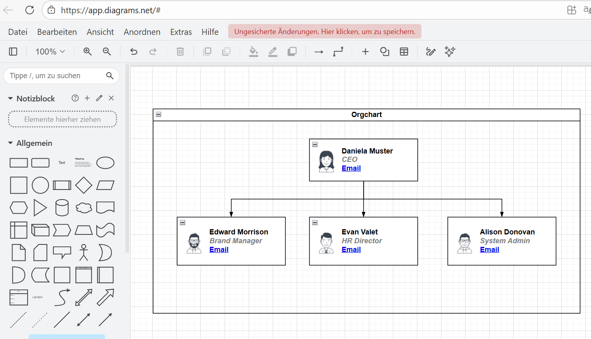

# Rollen & Funktionen

In einem Projekt sind folgende Rollen notwendig um eine erfolgreiche Abwicklung des Projektes zu ermöglichen:

- Projektauftraggeber:in (Erteilung des Auftrages)
- Projektleiter:in/ Projektmanager:in (Leitung und Koordinierung)
- Projektmitglied (Arbeitspakete werden erfüllt)
- Projektmitarbeitende (arbeitet an einer Aufgabe, nur für Teilleistung verantwortlich)
- Projektcoach (Unterstützung für das Team)

Die einzelnen Rollen sind mit unterschiedlichen Funktionen verknüpft.

## Tools
Mit draw.io kann ein Organigramm erstellt werden
