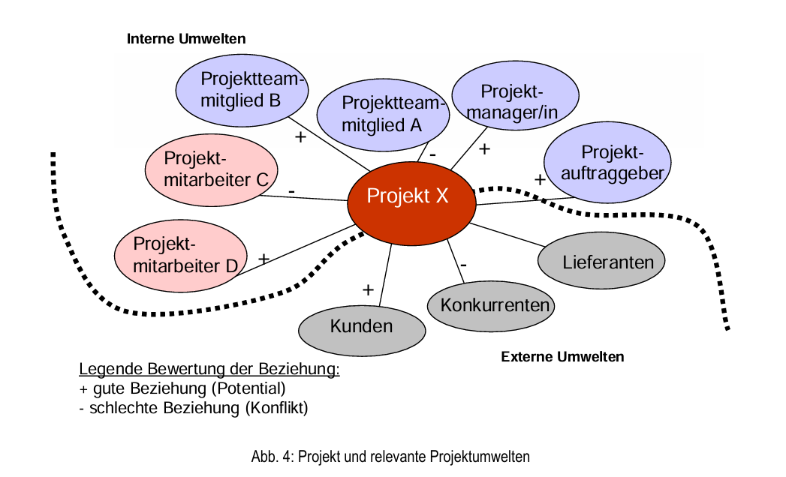

# Umweltanalyse

Durch eine **Projektumweltanalyse** soll ein **soziales System** dargestellt werden. Die **Gestaltung** der **Projektumweltbeziehung** ist eine **Projektmanagementaufgabe** 
Beispiel: 
- Wasserkraftwerk (Umweltverträglichkeitsprüfung, Bürgervereinigung)
- Tolino vs Kindle (Tolino, Zusammenschluss mehrere Buchhändler vs Amazon)
- ...

> **Tipp** Beim Test wird vielleicht ein kurzes Projekt vorgestellt, dessen Beziehungen "bewertet" werden sollen -nicht nur "+" und "-".

## Hard-Facts
Das sind **Projektziele, Projektleistungen, Projekttermine, Projektressourcen, Projektkosten, etc** Es handelt sich um exakt festgelegte Kriterien.

## Soft Facts
Das sind **Beziehungen im Projekt, Projektorganisation, Projektkultur, Risiken,..**

**Projektkultur:** Diese beschreibt das Miteinander. Um die Gemeinschaft zu fördern, kann ein eigenes **Logo** entwickelt werden, eine eigene **Kommunikationsform** gewählt werden etc.

[^1]: Projekt Management Austria. pm basic syllabus. Projektumweltanalyse.
Url: file:///C:/Users/anama-/Downloads/pm-basic-syllabus-101.pdf
 

