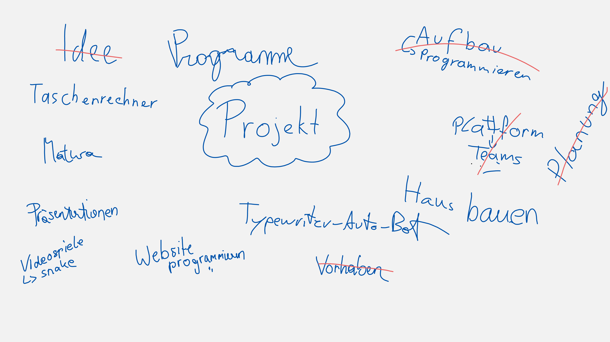
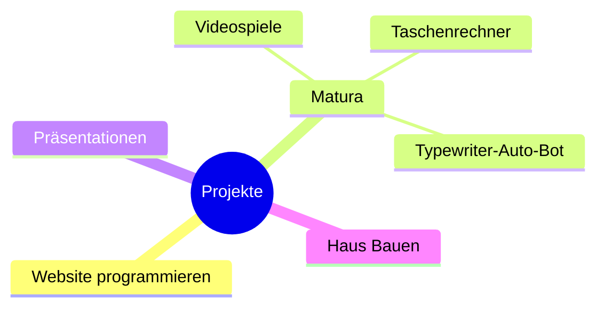

# Projekte

## Was ist ein Projekt

Ein Projekt ist ein Ereignis, das dazu dient ein bestimmtes **Ergebnis** zu erzielen. Es wird also ein **klares Ziel** verfolgt. *Erfahrungen* aus dem Projekt sollen auf kommende Projekte **transferiert** werden.  

## Eigenschaften
- Es wird ein klares Ziel verfolgt
- Es gibt einen zuvor definierten Zeitrahmen. Die **Laufzeit** ist **begrenzt**.
- Es handelt sich u eine komplexe **Aufgabe** (meist neuartig)
- Es herrscht ein **soziales System (innen und außen)**. Die **Beziehungen im Projekt und außerhalb** müssen unterschieden werden.
- Die verfügbaren Ressourcen sind begrenzt (Personal, Geld, Material, Know-How,...)

> **Hinweis:** **Stakeholder** ist eine Person, die am Verhalten eines Unternehmens interessiert ist (zB Aktionär, Gesellschaft, Mitarbeiter, Kunde, Lieferant,...)

>**Hinweis** Unklare Begriffe und ungeeignete wurden gestrichen bzw. ergänzt (zB Idee, Planung,... gehören zum Thema Projektmanagement aber sind selbst kein Beispiel für ein Projekt )

 

## Tool
Mit Mermaid kann ein einfaches Brainstorming durchgeführt und eine Mindmap in Markdown-Dateien angezeigt werden.
