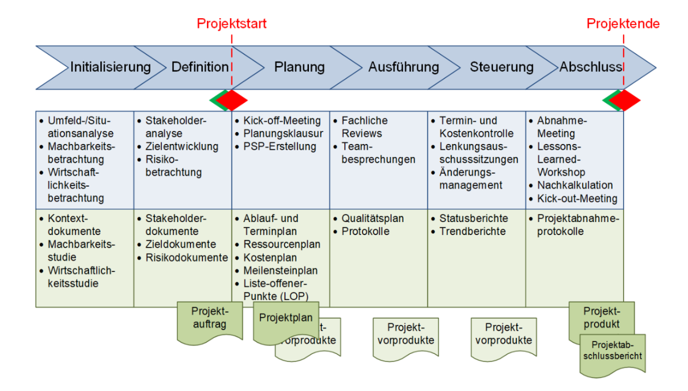
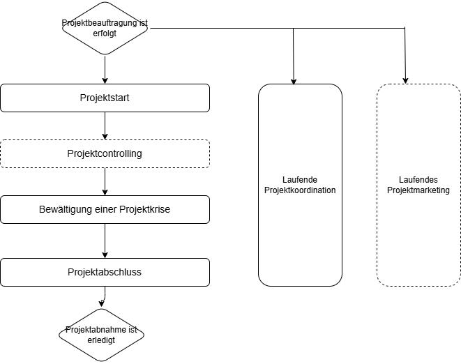
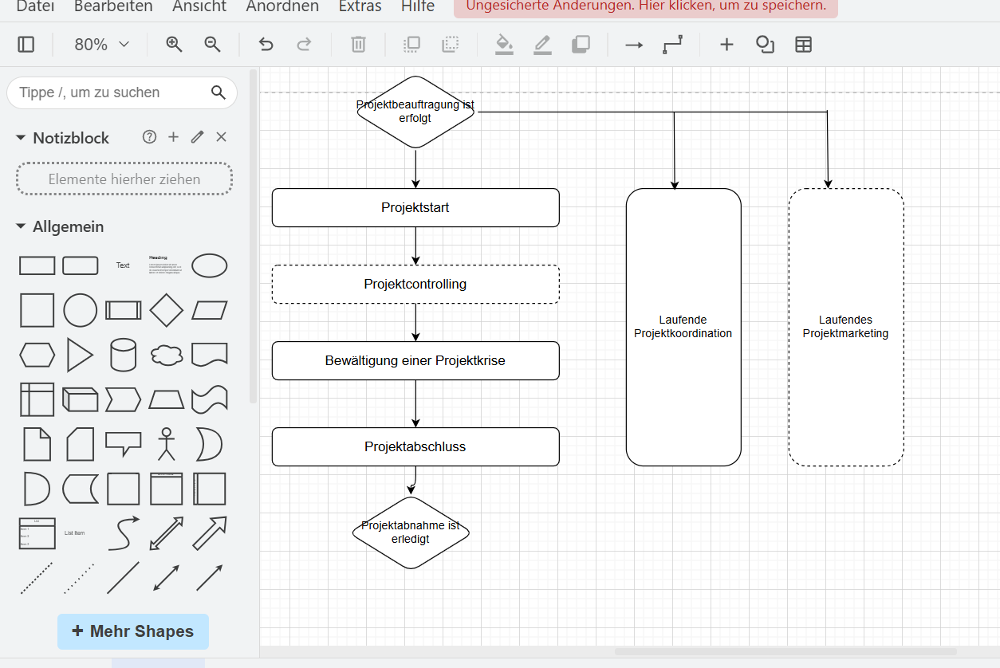

# Projektmanagement

## Allgemeines

**Projektmanagement** dient der effizienten Verwendung der Ressourcen eines Unternehmens und hat zum **Ziel** eine sehr gute Qualität zu erreichen
Der Erfolg kann nicht garantiert werden - ohne ein begleitendes Projektmanagement ist jedoch die Wahrscheinlichkeit zu scheitern größer.

> **Hinweis:** Als Ressourcen werden alle Mittel, welche zur Planung, Umsetzung und schließlich zum erfolgreichen Abschluss eines Projektes benötigt werden, bezeichnet (zB Geld, Personal, Zeit,...)

## Softwareentwicklung[^1]

Programmierung bedeutet nicht Softwareentwicklung. Software-Engineering ist ein **verwalteter Prozess**. Die Softwareentwicklung unterliegt in einem Unternehmen:

- zeitlichen,
- finanziellen und
- betrieblichen Beschränkungen

>**Hinweis** Für eine Softwarefirma sind gute Programmierer das "größt Kapital". (Job... Senior,...)

## Ablauf eines Projektes

Der Projektmanagementprozess startet mit der **Projektbeauftragung** und endet mit der **Projektabnahme**.

 [^2]
 [^3]
[!file](assets/Projektmanagementprozess.drawio)

## Tool 
Mit Draw.io [https://www.draw.io](https://www.draw.io) können rasch Grafiken, Diagramme, etc erstellt werden. Das Tool kann kostenlos eingesetzt wetden und erlaubt die Erstellung von verscheidenen Bildformaten (zB png). Ein Diagramm kann als `drawio`-Datei gespeichert und später in der App wieder bearbeitet werden.

[^1]: Vergl. **Sommerville**, Ivan. Software Engineering. München: Pearson Deutschland GmbH. S 646.

[^2]: **Peterjohann**, Horst. Prozesse in Projekten. Unterteilung von Projekten in einzelne Ablaufschritte.
URL: [https://www.peterjohann-consulting.de/projektphasen/](https://www.peterjohann-consulting.de/projektphasen/), Datum: 26.08.2025 

[^3]: Projekt Management Austria. pm basic syllabus. Projektmanagement und Projektmanagement Teilprozesse. S 6.
URL: [https://www.pma.at/de/zertifizierung/projektmanagement/pm-basic](https://www.pma.at/de/zertifizierung/projektmanagement/pm-basic)
