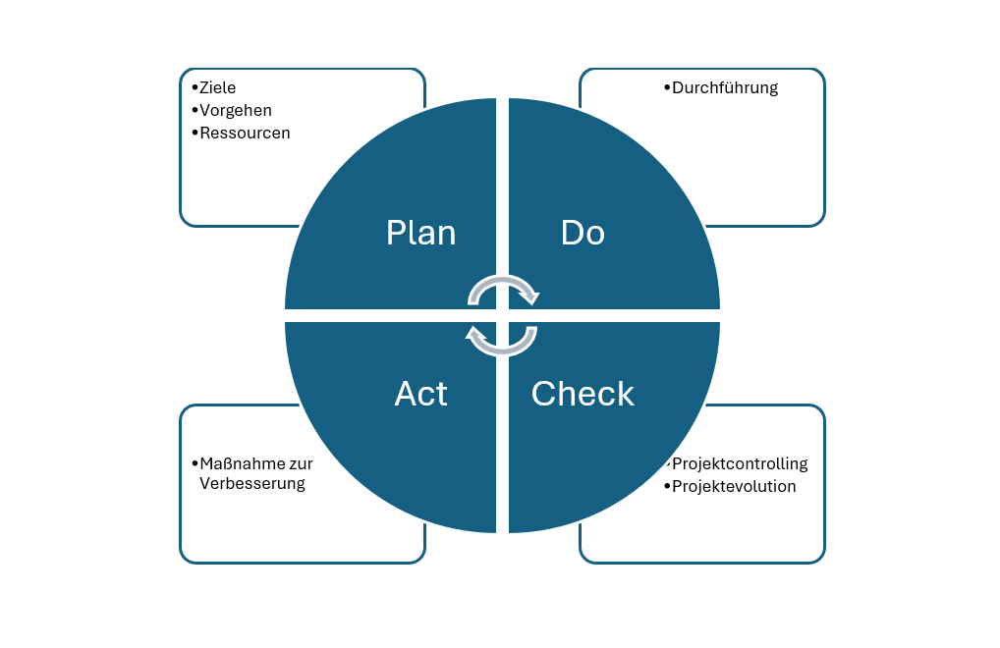

# Qualitätsmanagement

## Deming- Kreis

Die Kundenerwartung soll im Sinne einer Projektmanagement-Aufgabe gesteuert werden. Um **qualitätsorientiert** zu arbeiten, soll der *Demin-Kreis/PDCA-Zyklus** befolgt werden.

> **Hinweis:** Mit **Controlling-Maßnahmen** ist es möglich Ziele neu zu formulieren bzw. zu adaptieren.

## Tool 
In Word kann eine SmartArt namens Zyklus-Matrix eingefügt und die entsprechende Segment rasch beschriftet werden.

[!file](assets/Deming-Kreis.docx)

## Agile Softwareentwicklung

Mit der Agilen Softwareentwickung wird versucht die Sofrtware flexibler, schneller zu erstellen. Durch mehrere zyklische Besprechungen bzw. Vorstellungen wird der Kunde besser in die Entwicklung miteinbezogen und kann durch das Produkt wesentlich mitbestimmen.

> **Hiweis** **Vereinbarungen** hinsichtlich **Umfang des Projektes/ Produktes** sind selbstversändlich einzuhalten.

Durch diese Art der Softwareentwicklung soll ein Produkt entstehen, das dem Kundenwunscht entspricht. 

In der folgen Grafik wird ein Projekt "ohne Kundenbeteiligung" dargetellt. Der Kunde wird nicht informiert und erhält zum Abschluss das nicht gewüschte Projekt.

## Scrum

**Framework:**
Strukturierte Vorgehensweise für Projektmanagement
Scrum ist ein agiles Framework für Softwareentwicklung

- **Scrum Master:**
  Moderator und Coach des Scrum-Teams
  Entfernt Hindernisse, sorgt für Einhaltung der Scrum-Regeln
  Unterstützt das Team bei der Selbstorganisation

- **Sprint:**
  Zeitlich festgelegter Arbeitszyklus (meist 1–4 Wochen)
  In diesem Zeitraum werden definierte Aufgaben umgesetzt
  Am Ende steht ein potenziell auslieferbares Produktinkrement

- **Backlog:**
  Priorisierte Liste aller Anforderungen und Aufgaben
  Product Backlog: Gesamte Produktanforderungen
  Sprint Backlog: Aufgaben für den aktuellen Sprint

- **Arbeitspakete:**
  Konkrete, klar abgegrenzte Aufgaben
  Aus dem Backlog abgeleitet
  Beschreiben was umgesetzt wird
  Haben ein definiertes Ziel und Ergebnis
  Sind zeitlich planbar
  Werden einzelnen Personen oder Teams zugewiesen

- **Product Owner:**
  Verantwortlich für das Product Backlog
  Vertritt die Interessen der Stakeholder
  Priorisiert Anforderungen

- **Product:**
  Das zu entwickelnde Produkt/System
  Wird iterativ in Sprints weiterentwickelt

- **Daily Standup-Meeting:**
  Kurzes tägliches Team-Meeting (ca. 15 Minuten)
  Jeder beantwortet: Was habe ich gemacht? Was mache ich heute? Gibt es Hindernisse?

- **User Story:**
  Kurze Beschreibung einer Anforderung aus Nutzersicht

- **Format:** "Als [Rolle] möchte ich [Funktion], damit [Nutzen]"
  Basis für die Entwicklung
  [^1]: Dr. Possel, Heiko, Projekt-Management CVartoon. Wie IT-Projekte wirklich funktionieren. Url: https://www.programmwechsel.de/lustig/management/schaukel-baum.html
  Datum letzter Aufruf: 9. Dez 2025

[^1]
[^1]: Dr Possel, Heiko, Projekt-Management Cartoon. Wie IT Projekte wirklich funktionieren. Url: https://www.programmwechsel.de/lustig/management/schaukel-baum.html
Datum letzter Aufruf: 09. Dez. 2025

