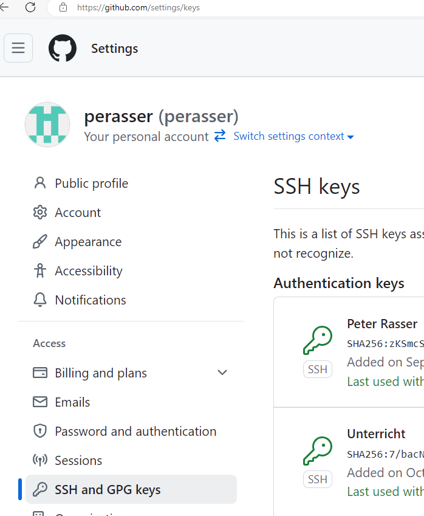

# Allgemeines

Git ist eine Software zur verteilten Versionsverwaltung.

Git kann auch nur lokal verwendet werden. Dadurch erhält man die Möglichkeit ein Verzeichnis zu versionieren.

## Installation

Die Git-Software ist unter https://git-scm.com kostenlos erhältlich.

:::note
Die Software wird zB unter **Download for Windows** heruntergeladen und mit den Standardeinstellungen installiert.
:::


## Konfiguration

Die Konfiguration kann einfach in der Eingabeaufforderung durchgeführt werden. Es werden folgende Befehle verwendet:

```powershell
git config --global user.name "Peter Rasser"
git config --global user.email "peter.rasser@hakzell.at"
git config --global init.defaultBranch "main"
```

Da der Parameter `--global` verwendet wird, können diese Befehle in einem beliebigen Verzeichnis ausgeführt werden.

Nach diesen Befehlen befindet sich im Benutzerverzeichnis eine Datei namens `.gitconfig`. Diese Datei beinhaltet die oben durchgeführte Konfiguration.

:::note
Um schnell in das Benutzerverzeichnis zu gelangen, kann in der Adresszeile (nach einem Klick auf die leere Zeile rechts) `%userprofile%` eingegeben werden.
:::


Die Datei hat danach folgenden Inhalt:

```
[user]
	name = Peter Rasser
	email = peter.rasser@hakzell.at
[init]
	defaultBranch = main
```

:::warning
Falls die `.gitconfig`-Datei nicht angezeigt wird, müssen die "ausgeblendeten Dateien" bzw. die Systemdateien **eingeblendet** werden.
:::

## Kommunikation mit GitHub

Um auf private Repositorys schreibend auf GitHub zugreifen zu können, ist eine Authentifizierung (und logischerweise ein Benutzerkonto) notwendig.

:::note
**Authentifizierung** bedeutet eine Anmeldung an einem System. **Autorisierung** überprüft die Berechtigungen eines Benutzers.
:::

Zur Authentifizierung wird ein Benutzerkonto mit den korrekten Anmeldedaten benötigt. Eine Anmeldung kann auch mit Schlüsseln vorgenommen werden. Hierbei wird ein **Public-Key-Verfahren** eingesetzt.

Das **Public-Key-Verfahren** verwendet einen **privaten** und einen **öffentlichen** Schlüssel.

Ein Schlüsselpaar wird mit `ssh-keygen -t ed25519` in der Eingabeaufforderung erstellt.


Die Standardwerte können mittels `ENTER` übernommen werden.

:::note
Ein Passwort, welches bei der Schlüsselerstellung gesetzt werden kann, erhöht die Sicherheit des Schlüssels. Das Passwort muss jedoch bei der Verwendung des Schlüssels stets angegeben werden.
:::

Im Ordner `%userprofile%\.ssh` befinden sich nach der Erstellung ein öffentlicher Schlüssel (zB `id_ed25519.pub`) und ein dazugehöriger privater Schlüssel (zB `id_ed25519`).


Dieses Schlüsselpaar muss nur einmalig erstellt werden und kann auch auf einem anderen, zusätzlichen PC verwendet werden. Das Schlüsselpaar sollte in diesem Fall "sicher" übertragen werden (der gesamte `.ssh`-Ordner).

Der **öffentliche** Schlüssel wird bei GitHub (einmalig) hinaufgeladen (im Bild zB mit dem Namen "Unterricht").



:::danger
Der **private Schlüssel** verlässt die eigenen PCs NICHT (= keine Weitergabe an andere Personen)! 
:::


